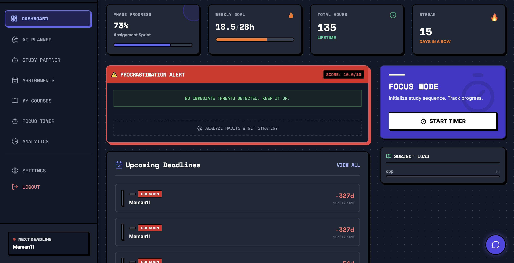
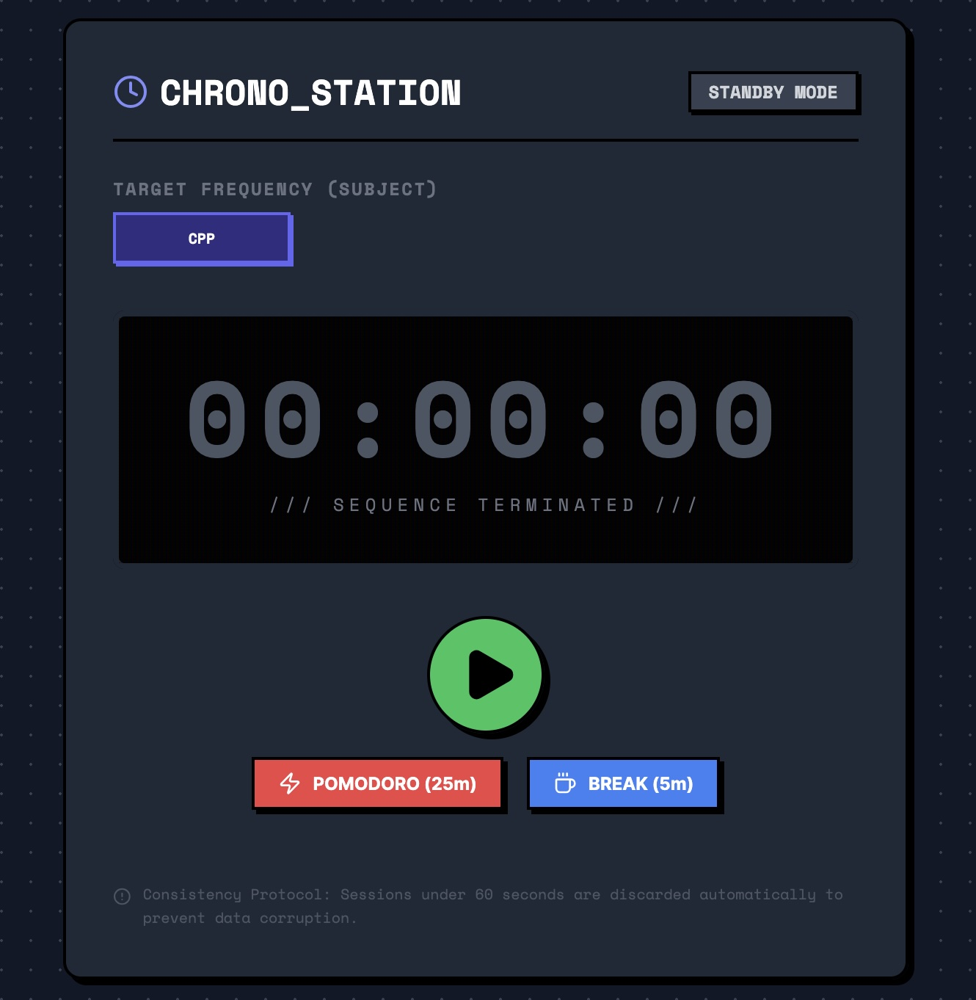
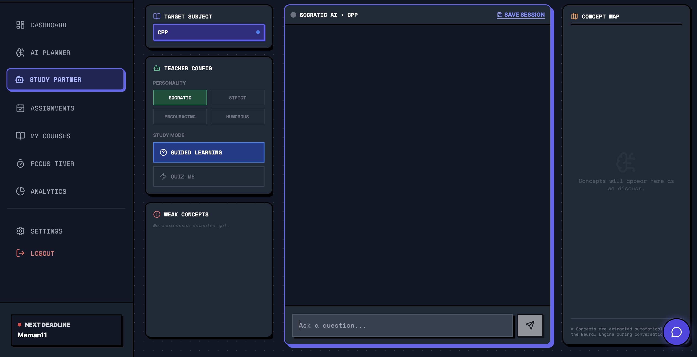
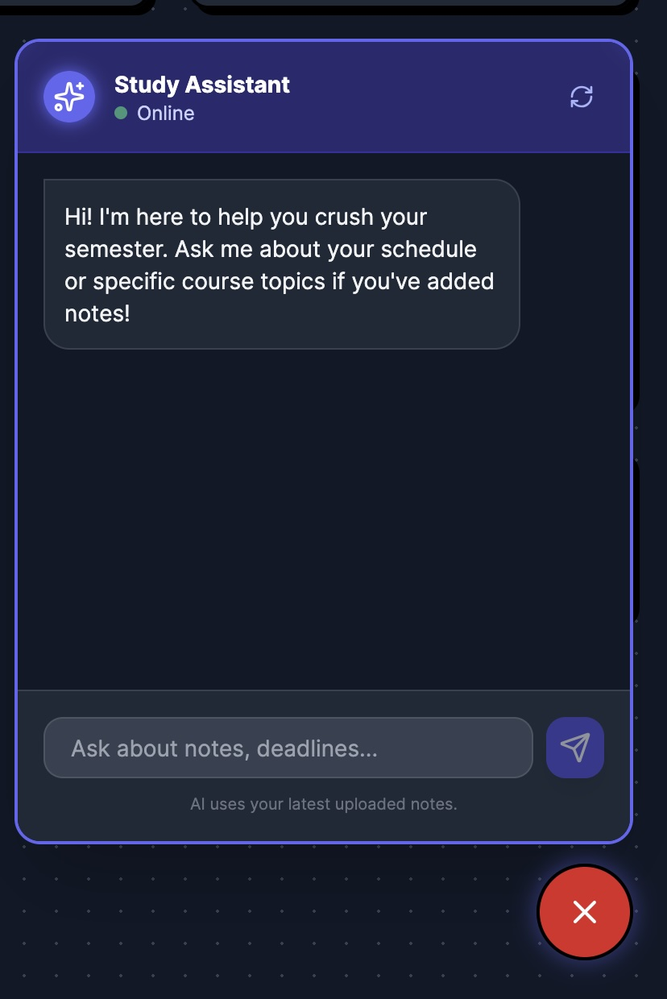

<div align="center">

# 🎓 SemesterFlow

## *Your AI-Powered Academic Command Center*

[](https://react.dev/)
[](https://www.typescriptlang.org/)
[](https://vitejs.dev/)
[](https://supabase.com/)
[](https://sentry.io/)

**SemesterFlow** is a retro-styled, AI-enhanced study management platform that transforms how students track assignments, manage time, and conquer procrastination.

[Features](#-features) • [Demo](#-demo) • [Quick Start](#-quick-start) • [Tech Stack](#-tech-stack) • [Contributing](#-contributing)

</div>

---

## 🚀 Features

### 📊 **Smart Dashboard**
- Real-time overview of all courses, assignments, and study stats
- Streak tracking with gamified study goals
- Weekly progress visualization
- Upcoming deadline alerts

### ⏱️ **Study Timer with AI Integration**
- Pomodoro-style focus sessions
- Automatic session logging to Supabase
- Difficulty ratings and session notes
- AI-powered study insights via Gemini

### 📚 **Assignment Management**
- Track assignments with due dates and status
- CSV import for bulk assignment creation
- Automatic procrastination detection
- Priority-based sorting

### 🗓️ **Smart Planner**
- Calendar view with assignment deadlines
- Course-based filtering
- Visual timeline of upcoming work
- Exam date tracking

### 🧠 **AI Study Partner**
- Powered by Google's Gemini AI
- Context-aware tutoring based on your courses
- Understands your weak concepts and study history
- Real-time chat assistance

### 🤖 **Procrastination Breaker**
- Detects when you're procrastinating
- Suggests micro-sprints (5-15 minute sessions)
- Motivational nudges
- Smart timer quick-start

### 📈 **Analytics Dashboard**
- Study time breakdown by course
- Performance trends over time
- Difficulty analysis
- Progress toward semester goals

### 📎 **Attachment Management**
- Link course materials (Google Drive, Notion, etc.)
- Quick access to resources
- Organized by course

### ⚙️ **Settings & Customization**
- Dark/Light mode toggle
- Semester configuration
- Study goal settings
- Data export options

---

## 🎮 Demo

### Dashboard View


*Real-time overview with phase progress, weekly goals, study streak, and procrastination alerts*

### Study Timer in Action


*Pomodoro-style focus sessions with course selection and session tracking*

### AI Study Partner


*Intelligent tutoring with customizable personality and study modes*

### AI Chat Assistant


*Context-aware study assistance powered by Google Gemini*

---

## 🛠️ Tech Stack

### **Frontend**
- **React 19.2** - UI framework
- **TypeScript 5.8** - Type safety
- **Vite 6.2** - Build tool & dev server
- **Tailwind CSS** - Styling (retro/neobrutalism theme)
- **Lucide React** - Icon library
- **Recharts** - Data visualization

### **Backend & Services**
- **Supabase** - Authentication & PostgreSQL database
- **Google Gemini AI** - AI-powered study assistance
- **Sentry** - Error tracking & performance monitoring
- **Express.js** - API server for Gemini integration

### **State Management**
- React Context API
- Custom hooks for data fetching
- Real-time Supabase subscriptions

---

## ⚡ Quick Start

### Prerequisites
- **Node.js 18+** (recommended: 20+)
- **npm** or **yarn**
- **Supabase account** (free tier)
- **Gemini API key** (free from Google AI Studio)

### 1. Clone the Repository
```bash
git clone https://github.com/ItamarS3917/SemesterFlow.git
cd SemesterFlow
```

### 2. Install Dependencies
```bash
npm install
```

### 3. Set Up Environment Variables

Create a `.env` file in the root directory:

```env
# Supabase Configuration
VITE_SUPABASE_URL=your_supabase_project_url
VITE_SUPABASE_ANON_KEY=your_supabase_anon_key

# Optional: Sentry (for error tracking)
VITE_SENTRY_DSN=your_sentry_dsn
```

Create a `.env` file in the `server/` directory:

```env
# Gemini API Key
GEMINI_API_KEY=your_gemini_api_key

# Server Port (optional)
PORT=3000
```

### 4. Set Up Supabase Database

Run the SQL schema in your Supabase SQL editor:

```bash
cat supabase_schema.sql
```

Copy and execute the SQL in [Supabase Dashboard](https://app.supabase.com/) → SQL Editor.

### 5. Start the Backend Server

```bash
cd server
npm install
npm start
```

Server runs on `http://localhost:3000`

### 6. Start the Frontend

```bash
# From root directory
npm run dev
```

App runs on `http://localhost:5173`

---

## 📁 Project Structure

```text
SemesterFlow/
├── components/          # React components
│   ├── Analytics.tsx
│   ├── AssignmentsView.tsx
│   ├── ChatBot.tsx
│   ├── CoursesView.tsx
│   ├── LoginPage.tsx
│   ├── PlannerView.tsx
│   ├── ProcrastinationWidget.tsx
│   ├── SettingsView.tsx
│   ├── StudyPartner.tsx
│   └── StudyTimer.tsx
├── contexts/           # React Context providers
│   ├── AppProvider.tsx
│   ├── AuthContext.tsx
│   └── DarkModeContext.tsx
├── hooks/              # Custom React hooks
│   ├── useAssignments.ts
│   ├── useCourses.ts
│   ├── useSessions.ts
│   └── useStats.ts
├── services/           # API and external services
│   ├── supabaseClient.ts
│   └── geminiService.ts
├── utils/              # Utility functions
│   └── dateUtils.ts
├── server/             # Express backend for Gemini
│   ├── index.js
│   └── package.json
├── mcp-server/         # MCP server for Claude integration
├── docs/               # Documentation
├── App.tsx             # Main app component
├── index.tsx           # App entry point (with Sentry)
├── types.ts            # TypeScript type definitions
├── constants.ts        # Initial data & constants
└── supabase_schema.sql # Database schema
```

---

## 🔧 Configuration

### Supabase Setup

1. Create a project at [supabase.com](https://supabase.com)
2. Copy your project URL and anon key
3. Run the SQL schema in `supabase_schema.sql`
4. Enable Email authentication in Supabase Auth settings

### Gemini API Setup

1. Get a free API key from [Google AI Studio](https://aistudio.google.com/app/apikey)
2. Add it to `server/.env`
3. The backend proxies requests to keep your API key secure

### Sentry Setup (Optional)

1. Create a free account at [sentry.io](https://sentry.io)
2. Create a project and copy the DSN
3. Add to `.env` as `VITE_SENTRY_DSN`

---

## 🎨 Design Philosophy

**Retro Neobrutalism**
- Bold, chunky borders
- High contrast colors
- Pixel-perfect shadows
- Monospace typography
- Gamified UI elements

**Dark Mode Support**
- Toggle between light and dark themes
- Persistent user preference
- Consistent color palette

---

## 📊 Database Schema

### Tables
- **`courses`** - Course information and progress
- **`assignments`** - Assignment tracking with procrastination detection
- **`study_sessions`** - Timed study session logs
- **`user_stats`** - Aggregated user statistics
- **`attachment_links`** - Course material links

### Row Level Security (RLS)
All tables have RLS policies to ensure users can only access their own data.

---

## 🤝 Contributing

We love contributions! Check out our [CONTRIBUTING.md](CONTRIBUTING.md) for guidelines.

### Quick Contribution Guide

1. **Fork the repo**
2. **Create a feature branch**
   ```bash
   git checkout -b feature/amazing-feature
   ```
3. **Commit your changes**
   ```bash
   git commit -m "feat: add amazing feature"
   ```
4. **Push to your fork**
   ```bash
   git push origin feature/amazing-feature
   ```
5. **Open a Pull Request**

### Commit Convention
We use [Conventional Commits](https://www.conventionalcommits.org/):
- `feat:` - New features
- `fix:` - Bug fixes
- `docs:` - Documentation changes
- `style:` - Code style changes
- `refactor:` - Code refactoring
- `test:` - Test additions/changes
- `chore:` - Build/tooling changes

---

## 🐛 Bug Reports & Feature Requests

Found a bug? Have an idea? [Open an issue](https://github.com/ItamarS3917/SemesterFlow/issues/new)!

**Bug Report Template:**
```markdown
**Describe the bug**
A clear description of what the bug is.

**To Reproduce**
Steps to reproduce the behavior.

**Expected behavior**
What you expected to happen.

**Screenshots**
If applicable, add screenshots.

**Environment:**
- OS: [e.g. macOS, Windows]
- Browser: [e.g. Chrome, Firefox]
- Version: [e.g. 1.0.0]
```

---

## 📄 License

This project is licensed under the **MIT License** - see the [LICENSE](LICENSE) file for details.

---

## 🙏 Acknowledgments

- **Google Gemini** - AI-powered study assistance
- **Supabase** - Backend infrastructure
- **Sentry** - Error monitoring
- **Lucide** - Beautiful icons
- **Recharts** - Data visualization
- **The Open Source Community** - For making this possible

---

## 📚 Documentation

- [MCP Setup Guide](docs/MCP_SETUP_GUIDE.md) - Set up monitoring and error tracking
- [Component Architecture](COMPONENT_ARCHITECTURE.md) - Understand the codebase
- [API Documentation](docs/API.md) - Backend API reference *(coming soon)*
- [Deployment Guide](docs/DEPLOYMENT.md) - Deploy to production *(coming soon)*

---

## 🌟 Star History

[](https://star-history.com/#ItamarS3917/SemesterFlow&Date)

---

## 📞 Contact

**Itamar** - [@ItamarS3917](https://github.com/ItamarS3917)

**Project Link:** [https://github.com/ItamarS3917/SemesterFlow](https://github.com/ItamarS3917/SemesterFlow)

---

<div align="center">

### Made with ❤️ and ☕ by students, for students

**[⬆ Back to Top](#-semesterflow)**

</div>
