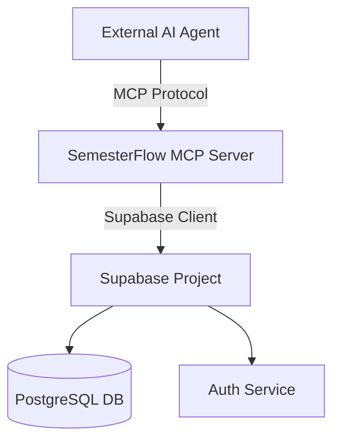

# SemesterFlow MCP Architecture

## Overview
This document details the architecture for the **SemesterFlow MCP Server**, a standalone service that exposes the application's data and capabilities to external AI agents using the Model Context Protocol (MCP).

## System Architecture



### Components
1.  **MCP Server (`mcp-server/`)**: A Node.js application running the `@modelcontextprotocol/sdk`.
2.  **Supabase Client**: Connects to the existing SemesterFlow Supabase project using service role keys (or user tokens in future).
3.  **Resources**: Read-only data exposed to the agent.
4.  **Tools**: Executable functions that modify state.

## Resources
Resources allow the AI to "read" the current state of the user's semester.

### `semesterflow://courses`
- **Description**: List of all active courses and their details.
- **Schema**:
  ```json
  [
    {
      "id": "uuid",
      "name": "Calculus I",
      "total_hours_target": 50,
      "hours_completed": 12,
      "next_exam_date": "2025-12-15"
    }
  ]
  ```

### `semesterflow://assignments`
- **Description**: List of pending and completed assignments.
- **Parameters**: `status` (optional filter: 'NOT_STARTED', 'IN_PROGRESS', 'COMPLETED')

### `semesterflow://stats`
- **Description**: Current user statistics (streak, total hours, phase).

## Tools
Tools allow the AI to "act" on behalf of the user.

### `add_assignment`
- **Description**: Create a new assignment.
- **Arguments**:
  - `courseId` (string, required)
  - `name` (string, required)
  - `dueDate` (string, optional)
  - `estimatedHours` (number, optional)

### `log_study_session`
- **Description**: Record a completed study session.
- **Arguments**:
  - `courseId` (string, required)
  - `durationMinutes` (number, required)
  - `topic` (string, optional)
  - `notes` (string, optional)

### `get_course_knowledge`
- **Description**: Retrieve context from a course's knowledge base.
- **Arguments**:
  - `courseId` (string, required)
  - `query` (string, required)

## Implementation Details

### Directory Structure
```
mcp-server/
├── package.json
├── tsconfig.json
├── .env
└── src/
    ├── index.ts       # Server entry point
    ├── supabase.ts    # Database connection
    ├── resources.ts   # Resource definitions
    └── tools.ts       # Tool definitions
```

### Authentication
- Initially, the server will run locally and use a **Service Role Key** in `.env` to access all data.
- **Future**: Implement user-level auth where the MCP client passes a user token.

## Roadmap
1.  **v0.1**: Basic read/write for Courses and Assignments.
2.  **v0.2**: Study Session logging and Stats retrieval.
3.  **v0.3**: Knowledge Base integration (RAG).
